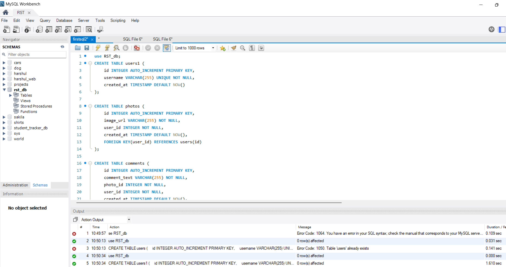

This ia a simple clone of an Instagram database which I have created in MYSQL workbench. I have created tables for likes, tags, photos, user and some other common functionalities  in  Instagram. This is a standalone program in MySQL.

## Requirements
* MySQL Workbench
* SQL
